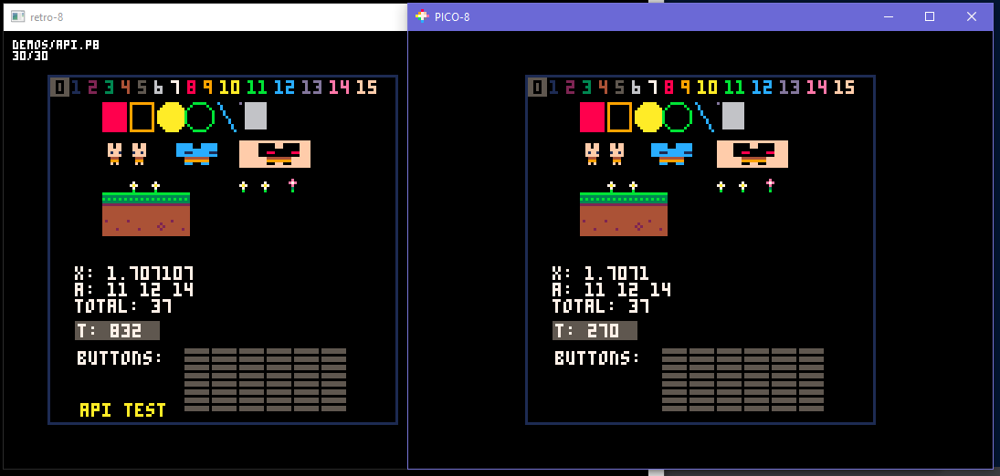
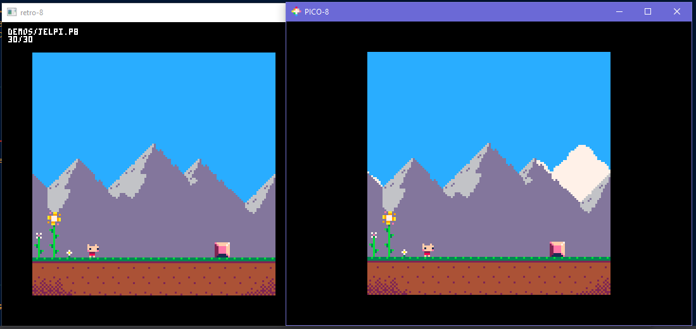
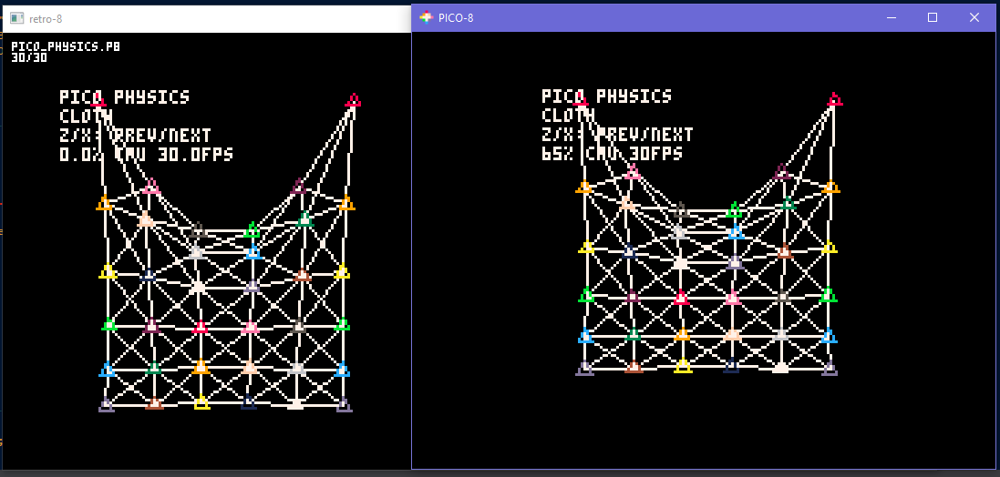

## Introduction

This is an attempt to have an open source reimplementation of PICO-8 fantasy console to be used on Desktop platforms but especially wherever you want to compile it.

It was born as an attempt to make PICO-8 games playable on OpenDingux devices (GCW0, RG350, ..).
It has now been extended to be compiled as a RetroArch core too.

## Implementation

The emulator is written in C++11 and embeds Lua source code (to allow extensions to the language that PICO-8 has). It has a SDL2.0 back-end but a SDL1.2 back-end wouldn't be hard to implement.

## Status

Currently much of the API is already working with good performance, even basic sound and music are working.

Many demos already work and even some full games.

- All graphics functions have been implemented but not all their subfeatures,
- All math functions have been implemented,
- Sound functions have been implemented together with an audio renderer stack but many effects still missing
- Common platform functions have been implemented
- Some Lua language extensions have been implemented
- Many quirks of the Lua extensions are implemented but some of most obscure things are still missing

Fixed arithmetic support is still missing.

## Screenshots





## Building

If you want to build a libretro backend:

```
make
```

If you want to build a local binary you can run:

```
cmake .
make
```

If you want to cross-compile for OpenDingux:

```
cmake -DOPENDINGUX=ON .
make
```

If you want to compile for retrofw (assuming your compiler is installed per [retrofw instructions](https://github.com/retrofw/retrofw.github.io/wiki/Making-Games)):

```
CROSS=/opt/mipsel-linux-uclibc/bin/mipsel-buildroot-linux-uclibc- cmake -DRETROFW=ON .
make
```

To build an OpenDingux OPK file once your binary is built:

```
mkdir -p projects/opendingux
cp -a retro8 projects/opendingux/
cd projects
./build_opk_od.sh
```
